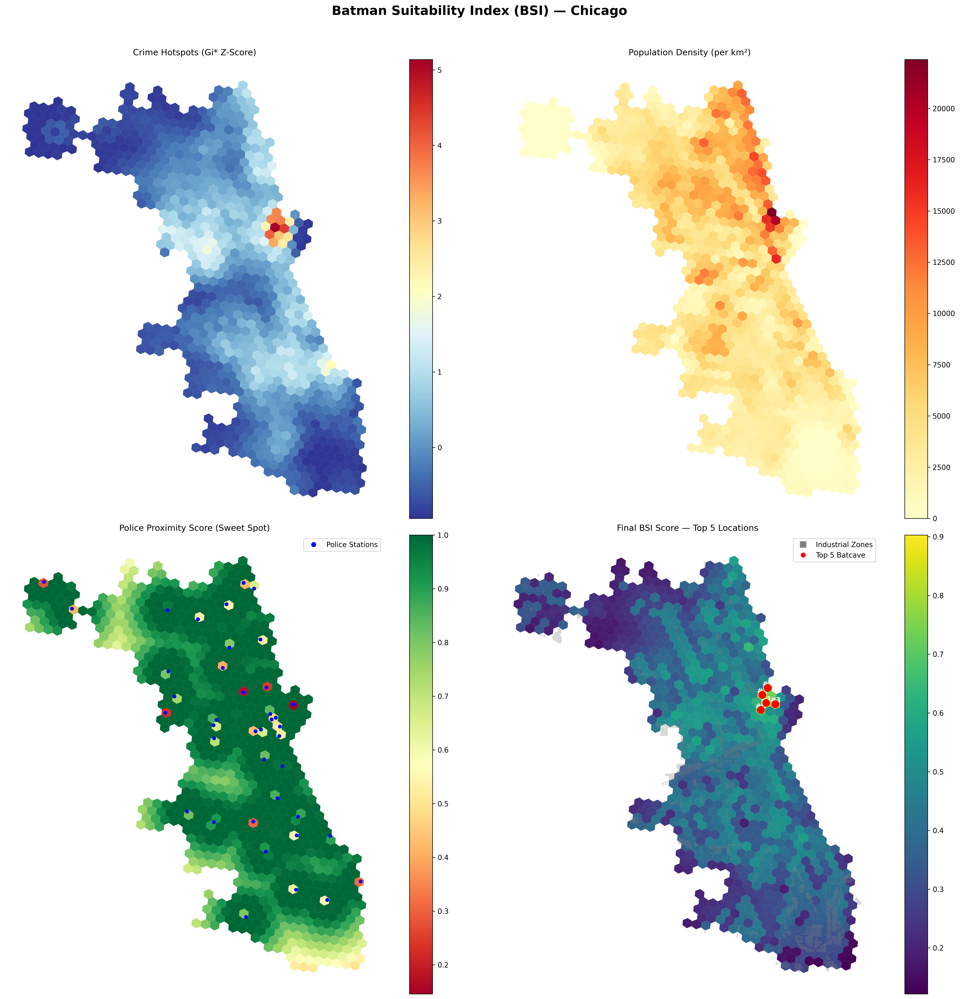

# The Batman Suitability Index

A multi-criteria spatial analysis that identifies the optimal strategic base of operations for Gotham's defender within the city of Chicago.

**Live story map:** https://robin-ede.github.io/batman-suitability-index/

[](https://robin-ede.github.io/batman-suitability-index/)

---

## The problem

Where in Chicago should Batman live and operate? A naive answer ("wherever crime is highest") ignores the other tactical constraints that actually define a viable base. Our model balances four weighted criteria over a hexagonal grid covering the full city:

- **Rapid access to crime hot spots:** statistically significant clusters where intervention matters, not random noise.
- **High population density:** maintaining a strong urban presence where people are.
- **Proximity to police infrastructure:** close enough to monitor law enforcement activity.
- **Industrial seclusion:** located within an industrial corridor for operational secrecy.

The resulting Batman Suitability Index (BSI) is computed per hex cell:

```
BSI = 0.35 × Crime Gi*  +  0.30 × Pop Density  +  0.20 × Police Sweet Spot  +  0.15 × Industrial
```

## Methodology

1. **Ingest:** Chicago crime (Socrata), census tracts + population (US Census TIGER/Line + API), industrial land use (OpenStreetMap / Overpass), police stations (OSM).
2. **Reproject** all sources to **NAD83 / Illinois East (EPSG:26971)** for metric distance calculations.
3. **Aggregate** to an **H3 hexagonal grid** so disparate geometries (points, polygons, tracts) can be compared across equal-area cells.
4. **Identify hot spots** with the **Getis-Ord Gi\*** statistic via `PySAL` (`esda.getisord.G_Local`, 999 permutations, α = 0.05). A cell is classified **Hot Spot** when its pseudo p-value is below 0.05 *and* its Gi\* z-score is positive, meaning the cell and its neighbors together are measurably above average.
5. **Normalize** each of the four components to [0, 1] and compute the weighted BSI.
6. **Export** the H3 grid, top-5 candidates, and supporting layers to GeoJSON-as-JS for the web visualization.

## Data sources

| Source | What | Access |
| --- | --- | --- |
| [Chicago Data Portal – Crimes 2001 to Present](https://data.cityofchicago.org/Public-Safety/Crimes-2001-to-Present/ijzp-q8t2/about_data) | ~1.0M crime incidents, filtered by year | Socrata API |
| US Census Bureau | TIGER/Line tract boundaries + ACS population | TIGER shapefiles + Census API |
| [OpenStreetMap](https://www.openstreetmap.org/) | Police stations, industrial land-use polygons | Overpass API |

All sources are public-domain or openly licensed for academic use. No personally identifying data is ingested; crime data is aggregated to hex cells before being exposed in the web map.

## Tech stack

**Pipeline:** Python 3.11, GeoPandas, Shapely, H3-Pandas, PySAL (esda), pandas, requests, Folium, matplotlib.

**Web:** Leaflet 1.9, Chart.js 4.4, vanilla JS, vanilla CSS. No build step; the `docs/` folder is a static site served by GitHub Pages.

## Reproducing the analysis

```bash
# 1. Install deps
python -m venv .venv && source .venv/bin/activate
pip install -r requirements.txt

# 2. Set API keys (Socrata app token + Census API key)
cp .env.example .env
# …edit .env with your keys

# 3. Run the full pipeline: fetch → process → analyze → visualize
python run.py

# 4. Regenerate the web bundle from the analyzed outputs
python export_for_web.py

# 5. Preview the story map locally
cd docs && python -m http.server 8000
# open http://localhost:8000/
```

The four numbered scripts (`01_fetch.py` … `04_visualize.py`) can also be run individually for partial re-runs.

## Repository layout

```
.
├── 01_fetch.py            # Socrata + Census + Overpass downloads
├── 02_process.py          # Clean, reproject to EPSG:26971, H3-aggregate
├── 03_analyze.py          # Getis-Ord Gi*, normalize, compute BSI
├── 04_visualize.py        # Static matplotlib + Folium maps
├── generate_figures.py    # Individual publication-quality figures (300 DPI PNGs)
├── export_for_web.py      # Analyzed outputs → docs/js/data/*.js
├── config.py              # Weights, CRS, thresholds, paths
├── run.py                 # One-command pipeline runner
├── requirements.txt
├── PROPOSAL.md            # Original project proposal
├── docs/                  # GitHub Pages site (the story map)
│   ├── index.html
│   ├── css/style.css
│   ├── js/map.js          # Leaflet layer management & interactions
│   ├── js/charts.js       # Chart.js weights + candidate components
│   ├── js/scroll.js       # Scroll-driven narrative sync
│   ├── js/data/*.js       # Exported GeoJSON bundles
│   └── images/            # Static map screenshots
├── data/                  # Raw + intermediate (gitignored)
└── output/                # Analysis outputs (gitignored)
```

## Ethics & scope

Crime data is aggregated to ~1 km² hex cells and reported alongside a hot-spot statistical test, not individual incidents or addresses. The BSI is a pedagogical composite (framed around a fictional protagonist) and is **not** intended as a policy or policing recommendation. Interpretations are deliberately framed to avoid stigmatizing neighborhoods or implying causal claims about crime.

## Team

Bob Cao · Robin Ede · Mauricio Moran

DAEN 489, Spatial Data Engineering, Spring 2026.
